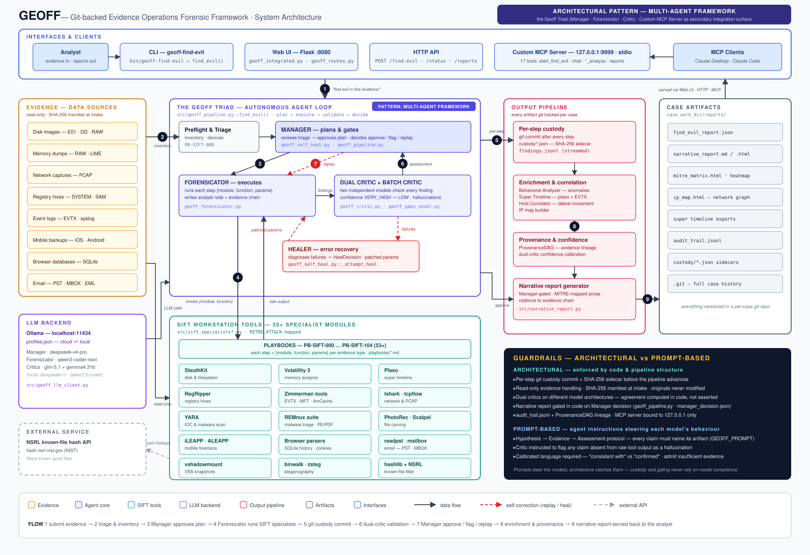
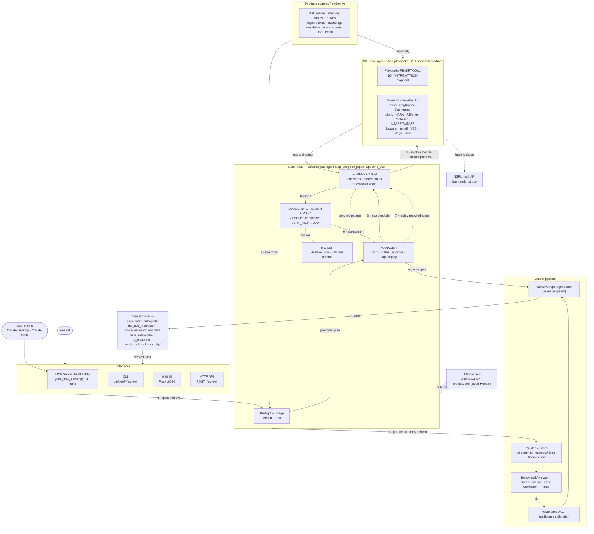

# GEOFF — Architecture

**Git-backed Evidence Operations Forensic Framework** — a multi-agent DFIR platform that
plans, executes, validates, and self-corrects an entire forensic investigation autonomously,
with every step git-committed for chain of custody.

High-resolution exports: [`architecture.svg`](architecture.svg) (vector, print-ready) ·
[`architecture.png`](architecture.png) (2580 px raster).

---

## How the components connect

## Execution flow

1. **Submit** — the analyst hands Geoff a goal ("find evil in this evidence") via CLI, Web UI, HTTP API, or MCP.
2. **Triage** — preflight inventories evidence (SHA-256 manifest, device discovery) and runs PB-SIFT-000 to propose an execution plan.
3. **Plan** — the **Manager** reviews, reorders, and approves the plan.
4. **Execute** — the **Forensicator** runs every playbook step, invoking SIFT specialist modules and turning raw tool output into structured analyst notes with evidence chains.
5. **Custody** — each completed step is git-committed with a `custody/<step>.json` SHA-256 sidecar and streamed to `findings.jsonl` before the pipeline advances.
6. **Validate** — the **Dual Critic Pool** (two independent models) checks every finding for hallucinations; a **Batch Critic** then reviews all findings holistically. Agreement drives the confidence grade (VERY_HIGH → LOW).
7. **Decide** — the **Manager** approves, flags, or orders an incremental replay of affected steps with patched parameters. Failed tool runs are diagnosed by the **Healer** (deterministic fix first, LLM `HealDecision` second).
8. **Enrich** — Behavioral Analyzer, Super Timeline, Host Correlator, and ProvenanceDAG add cross-device correlation, lineage, and calibrated confidence.
9. **Report** — the Manager-gated narrative generator writes the MITRE-mapped report; all artifacts are served back through the Web UI, HTTP API, and MCP tools.

## Component reference

| Component | Role | Key files |
|---|---|---|
| Pipeline entry | Orchestrates the whole investigation | `src/geoff_pipeline.py::find_evil()` |
| Manager | Plan approval, post-critic decision (approve/flag/replay) | `src/geoff_self_heal.py::_manager_review_execution_plan`, `src/geoff_pipeline.py::_manager_post_critic_decision` |
| Forensicator | Tool execution + structured analyst notes | `src/geoff_forensicator.py::call_forensicator_llm` |
| Critics | Per-step dual validation + holistic batch review | `src/geoff_critic.py`, `src/geoff_gaps_novel.py::GeoffCriticPool`, `src/geoff_pipeline.py::_batch_critic_review_all_playbooks` |
| Healer | Error diagnosis and recovery (`HealDecision`) | `src/geoff_self_heal.py::_attempt_heal` |
| SIFT specialists | 20+ tool wrapper modules (disk, memory, timeline, registry, network, malware, mobile, …) | `src/sift_specialists*.py` |
| Playbooks | 53+ MITRE-mapped step definitions | `playbooks/PB-SIFT-*.md` |
| LLM backend | Ollama, cloud ⇄ local model profiles | `src/geoff_llm_client.py`, `profiles.json` |
| MCP server | 17 tools (`start_find_evil`, `chat`, `*_analyze`, reports) on 127.0.0.1:9999 or stdio | `src/geoff_mcp_server.py` |
| Web UI / API | Flask app on :8080 | `src/geoff_integrated.py`, `src/geoff_routes.py` |
| Custody & audit | Per-step git commits, SHA-256 sidecars, audit trail | `src/geoff_pipeline.py::_commit_step_with_custody` |
| Enrichment | Behavior, timeline, correlation, provenance | `src/behavioral_analyzer.py`, `src/super_timeline.py`, `src/host_correlator.py`, `src/geoff_gaps_novel.py::ProvenanceDAG` |
| Narrative reports | Manager-gated MD/HTML report generation | `src/narrative_report.py` |
| External service | NSRL known-file hash elimination | `src/geoff_gaps_novel.py::HASH_Specialist` |

## Design guarantees

- **Chain of custody** — every step is git-committed with a SHA-256 sidecar before the pipeline advances.
- **Hallucination defense** — two independent critic models must agree; disagreement lowers confidence.
- **Self-healing** — deterministic fixes first, LLM-diagnosed `HealDecision` second, targeted replay last.
- **Evidence safety** — sources are processed read-only with a SHA-256 manifest taken at intake.
- **Reproducibility** — `audit_trail.jsonl` and the ProvenanceDAG trace every finding back to its source artifact.
