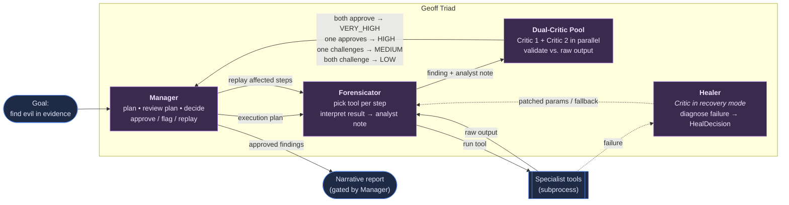
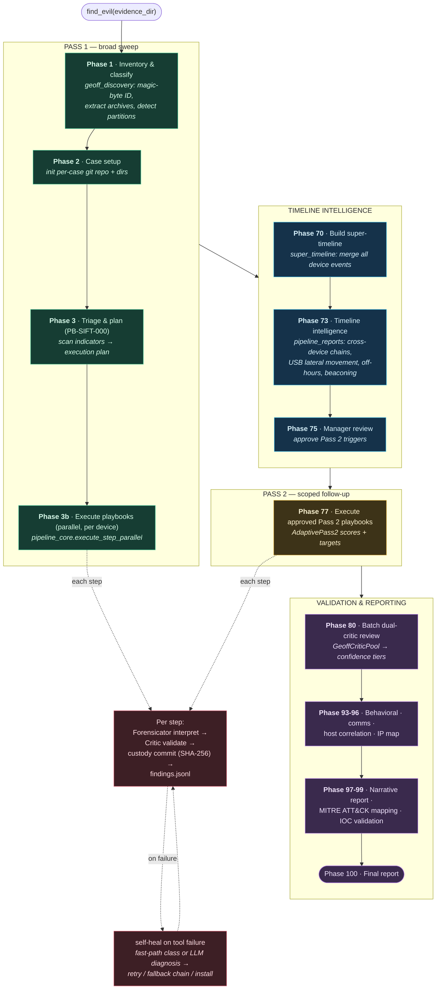
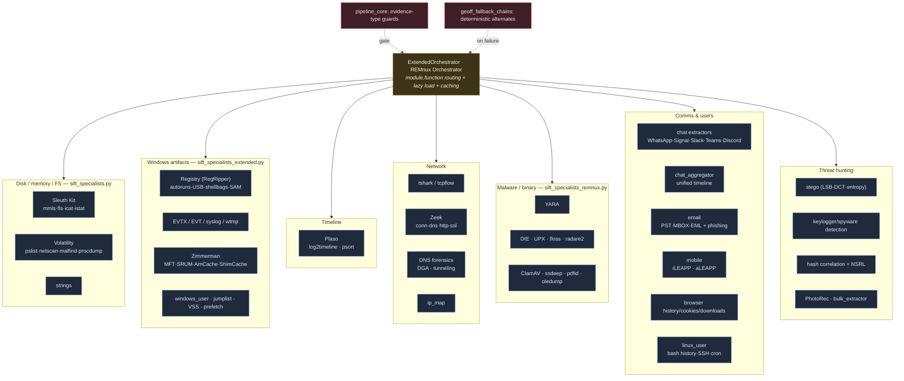

# GEOFF Architecture

**GEOFF** — *Git-backed Evidence Operations Forensic Framework* — is a multi-agent,
conversational DFIR platform. It ingests raw evidence (disk images, memory dumps,
PCAPs, registry hives, mobile backups), runs an autonomous two-pass investigation
across ~40 forensic specialist tool-wrappers, validates every finding with a dual-critic
LLM pool, and produces a cited narrative report with a tamper-evident chain of custody.

This document is the canonical architecture reference. All diagrams are
[Mermaid](https://mermaid.js.org/) and render directly on GitHub. A rendered
companion image of the system overview is shown below (sources:
[`architecture.png`](./architecture.png), [`architecture.svg`](./architecture.svg)).

> The shorter ASCII overview in the top-level [`README.md`](../README.md#component-architecture)
> is kept in sync with the diagrams here.

---

## 1. System layers

The platform is organized into seven layers. Requests enter at the top (CLI, web UI,
or MCP), flow down through orchestration into the agent loop and specialist tools, and
every step writes to the evidence-integrity and storage layers on the side.

```mermaid
flowchart TB
    subgraph ENTRY["① Entry points"]
        CLI["bin/geoff-find-evil<br/><i>one-shot CLI, exit-code aware</i>"]
        CONSOLE["bin/geoff_console.py<br/><i>interactive terminal client</i>"]
        WEBUI["static/ web UI<br/><i>Find Evil • Chat • Reports • IP map</i>"]
        MCPCLIENT["MCP clients<br/><i>Claude / IDE / agents</i>"]
    end

    subgraph API["② API & app surface"]
        FLASK["geoff_routes.py<br/><i>Flask REST + auth + chat</i>"]
        MCPSRV["geoff_mcp_server.py<br/><i>FastMCP @ 127.0.0.1:9999</i>"]
        BOOT["geoff_integrated.py<br/><i>bootstrap & singleton wiring</i>"]
        TEMPL["geoff_templates.py<br/><i>embedded HTML/JS</i>"]
    end

    subgraph ORCH["③ Investigation orchestration"]
        QUEUE["queue_manager.py<br/><i>priority job queue</i>"]
        PIPE["geoff_pipeline.py :: find_evil()<br/><i>13-phase two-pass driver</i>"]
        CORE["pipeline_core.py<br/><i>parallel step exec, guards, dedup</i>"]
        DISC["geoff_discovery.py<br/><i>inventory, classify, triage</i>"]
        REPORTS["pipeline_reports.py<br/><i>timeline intelligence → Pass 2</i>"]
        HEAL["geoff_self_heal.py<br/><i>error diagnosis & remediation</i>"]
    end

    subgraph AGENTS["④ The Geoff Triad (LLM agents)"]
        MGR["Manager<br/><i>plan / review / decide</i>"]
        FOR["Forensicator<br/><i>tool selection + interpretation</i>"]
        CRIT["Critic + Critic 2<br/><i>dual-critic validation pool</i>"]
        LLM["geoff_llm_client.py<br/><i>Ollama retry + rate limit</i>"]
    end

    subgraph SPEC["⑤ Forensic specialist layer (~40 tool wrappers)"]
        ORCHX["ExtendedOrchestrator / REMnux Orchestrator<br/><i>module.function → specialist routing</i>"]
        DISK["Disk & FS<br/>Sleuth Kit"]
        MEM["Memory<br/>Volatility"]
        NET["Network<br/>tshark · Zeek · DNS"]
        WIN["Windows<br/>Registry · EVTX · Zimmerman"]
        TL["Timeline<br/>Plaso"]
        MAL["Malware<br/>YARA · REMnux · DIE"]
        COMMS["Comms<br/>chat · email · mobile"]
        HUNT["Hunting<br/>stego · keylogger · hash/NSRL"]
    end

    subgraph ANALYSIS["⑥ Correlation & reporting"]
        DEV["device_discovery.py"]
        BEH["behavioral_analyzer.py"]
        STL["super_timeline.py"]
        HOST["host_correlator.py"]
        MITRE["geoff_mitre.py"]
        CONF["geoff_confidence.py"]
        NARR["narrative_report.py"]
        RAG["geoff_rag.py<br/><i>case Q&A</i>"]
    end

    subgraph INTEG["⑦ Evidence integrity & storage"]
        COC["geoff_chain_of_custody.py<br/><i>Merkle-chained custody log</i>"]
        PROV["geoff_provenance.py<br/><i>derivation DAG</i>"]
        CMDLOG["command_logger.py<br/><i>subprocess audit trail</i>"]
        GIT["per-case git repo<br/><i>append-only, custody sidecars</i>"]
    end

    CLI --> PIPE
    CONSOLE --> FLASK
    WEBUI --> FLASK
    MCPCLIENT --> MCPSRV
    FLASK --> BOOT
    MCPSRV --> BOOT
    FLASK --> QUEUE
    BOOT --> PIPE
    QUEUE --> PIPE

    PIPE --> DISC
    PIPE --> CORE
    PIPE --> REPORTS
    CORE --> HEAL

    CORE --> FOR
    FOR --> ORCHX
    FOR --> CRIT
    MGR -.plan/review.-> PIPE
    CRIT --> LLM
    FOR --> LLM
    MGR --> LLM
    HEAL --> LLM

    ORCHX --> DISK & MEM & NET & WIN & TL & MAL & COMMS & HUNT

    PIPE --> ANALYSIS
    STL --> NARR
    HOST --> NARR
    MITRE --> NARR
    CONF --> NARR

    CORE --> COC
    CORE --> CMDLOG
    ORCHX --> PROV
    COC --> GIT
    CMDLOG --> GIT

    classDef entry fill:#1f2a44,stroke:#5b8def,color:#dfe7ff
    classDef api fill:#15324a,stroke:#34b3e0,color:#d6f1ff
    classDef orch fill:#163d33,stroke:#3fbf8f,color:#d7ffe9
    classDef agent fill:#3a2a4d,stroke:#a974e0,color:#efe2ff
    classDef spec fill:#3d3318,stroke:#d6a635,color:#fff2cf
    classDef analysis fill:#143a3a,stroke:#2fb6b6,color:#d4fbfb
    classDef integ fill:#3d1f25,stroke:#d65a6e,color:#ffdce2

    class CLI,CONSOLE,WEBUI,MCPCLIENT entry
    class FLASK,MCPSRV,BOOT,TEMPL api
    class QUEUE,PIPE,CORE,DISC,REPORTS,HEAL orch
    class MGR,FOR,CRIT,LLM agent
    class ORCHX,DISK,MEM,NET,WIN,TL,MAL,COMMS,HUNT spec
    class DEV,BEH,STL,HOST,MITRE,CONF,NARR,RAG analysis
    class COC,PROV,CMDLOG,GIT integ
```

---

## 2. The Geoff Triad — agent loop

Geoff's execution engine is a three-role autonomous loop that plans, executes, observes,
critiques, and self-corrects with no human in the per-step loop. Each role runs on its
own model profile (`profiles.json`), and all roles talk to a single Ollama endpoint
through `geoff_llm_client.py`.

**Model profiles** (`profiles.json`; overridable per role via `GEOFF_*_MODEL` env vars):

| Role | Purpose | Cloud model | Local model |
|------|---------|-------------|-------------|
| **Manager** | Plans, reviews the execution plan, post-critic decisions | `deepseek-v4-pro:cloud` | `deepseek-r1:32b` |
| **Forensicator** | Selects tools, interprets each tool result | `qwen3-coder-next:cloud` | `qwen2.5-coder:14b` |
| **Critic** | Validates findings for hallucination / inconsistency | `glm-5.1:cloud` | `qwen2.5:14b` |
| **Critic 2** | Independent parallel validation (different architecture) | `gemma4:31b-cloud` | `gemma4:31b` |

The **Healer** is the Critic operating in error-recovery mode (`geoff_self_heal.py::_attempt_heal`
→ `_execute_heal`) — same model, different prompt, surfaced separately because it has its own
audit class.

---

## 3. The `find_evil()` pipeline — two-pass investigation

`geoff_pipeline.py::find_evil()` drives a 13-phase pipeline. **Pass 1** runs the
triage-selected playbooks across every device; the unified super-timeline is then mined
for cross-device intelligence that the Manager reviews to launch a scoped, intelligence-driven
**Pass 2**. All findings are validated by the dual-critic pool before the report is generated.
The run is checkpointed (git + checkpoint files), so it resumes after interruption.

---

## 4. Specialist layer

Each forensic technique is a dedicated specialist class with a uniform
`{status, stdout, stderr, parsed}` contract. The Forensicator never calls a tool directly —
it issues a `module.function` request that the orchestrators route to the right specialist.
Evidence-type guards in `pipeline_core.py` block nonsensical pairings (e.g. Volatility on a
disk image), and `geoff_fallback_chains.py` provides deterministic alternatives when a primary
tool fails.

---

## 5. Trust & data-flow boundaries

| Boundary | Enforcement | Mechanism |
|----------|-------------|-----------|
| Evidence path injection | **Code-enforced** | Shell-metacharacter allowlist in `geoff_routes.py` before any subprocess call |
| API authentication | **Code-enforced** | `GEOFF_API_KEY` bearer/`X-API-Key`; empty ⇒ local unauthenticated mode |
| MCP network isolation | **Code-enforced** | FastMCP binds `127.0.0.1:9999` only |
| Evidence non-modification | **Detective** | Per-step SHA-256 custody sidecars; tools read evidence, never write to it |
| Output isolation | **Code-enforced** | All output (findings, custody, git) goes to the work dir, never back into evidence |
| Report grounding | **Code-enforced (chat) / prompt-only (report)** | `_self_check_chat_response` regenerates ungrounded chat; narrative report relies on prompt instructions (see `docs/ACCURACY_REPORT.md`) |

**Key data artifacts produced per case:** `findings.jsonl`, `find_evil_report.json`,
`timeline/super_timeline.jsonl`, `narrative_report.md`, custody sidecars + Merkle custody log,
`commands/*.jsonl` audit trail, and a `rag/rag_index.json` for case Q&A — all committed to the
append-only per-case git repository.
